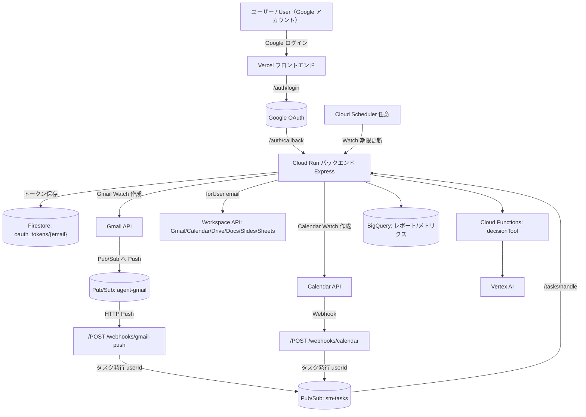
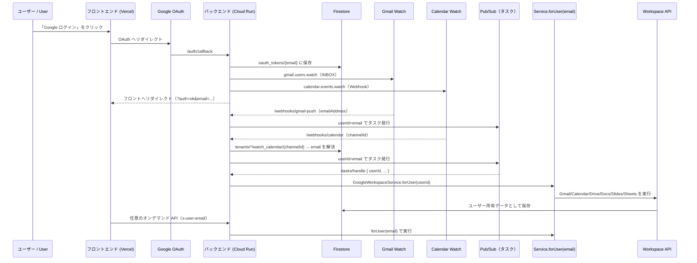
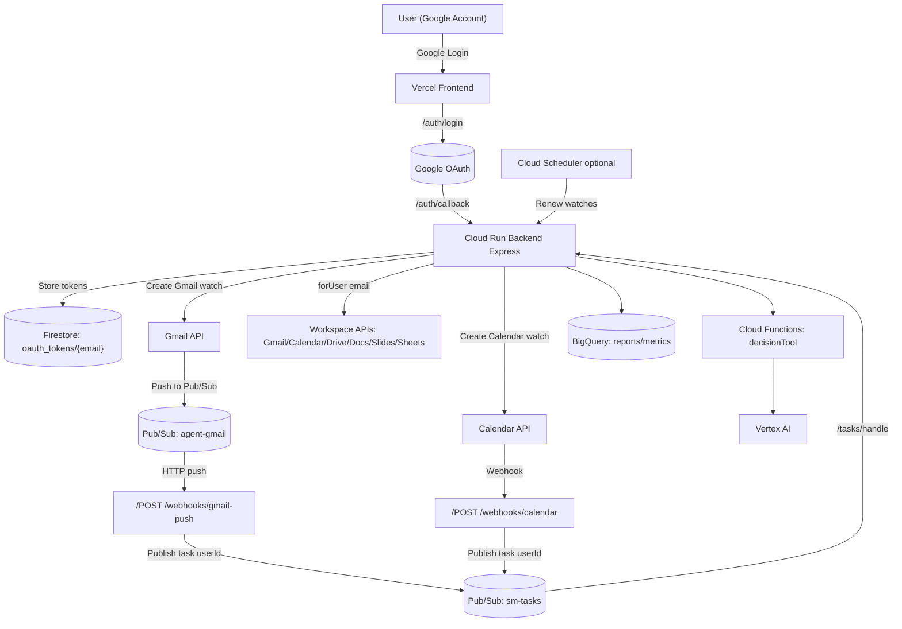

# スマートミート 自律会議エージェント

**Build for 第3回 AI Agent Hackathon with Google Cloud**

このプロジェクトは、対話形式に頼ることなく「会議の必要性の検知 → 日程調整 → 開催確定 → 関連資料の作成・配布 → フォローアップ」という一連のプロセスを自律的に完結させる、Google CloudとVertex AIを基盤としたエージェントです。

## 設計コア
- 目的: Gmail、Googleカレンダー、Googleドライブでの活動をトリガーに必要な会議を検出し、Vertex AIによる意思決定を経て、Google Workspace上でアジェンダ、議事録、ToDoリストなどの成果物を作成・配布します。
- アプローチ: イベント駆動型アーキテクチャ、冪等性の確保、そしてポリシーに基づいた重み付けスケジューリングを採用しています。データパスはすべてGoogle Cloudネイティブのサービスで完結します。
- 自律ループ: 「感知 → 解析 → 決定 → 実行 → 学習」のサイクルを自律的に繰り返します。システムにはセーフティガードと監視機能が組み込まれています。

## アーキテクチャ
- Cloud Run (Node.js / Express): 公開API、Webhook（Gmail Push / Calendar Watch）、管理・内部ジョブを提供します。アプリケーションはステートレスに設計され、状態はFirestoreで管理されます。
- Cloud Functions (decisionTool): 状況解析とポリシー評価を行います（データソースとしてBigQueryを利用）。
- Vertex AI: モデルによる生成や推論は、Vertex AI SDK経由でのみ実行します（Gemini APIの直接呼び出しは行いません）。
- Google Workspace API: Gmail, Calendar, Drive, Docs, Slides, Sheetsを連携させ、実務作業を自動化します。
- イベント処理: Pub/Sub（Gmail Push通知）、Calendar Webhook、バックグラウンドキューを活用し、信頼性の高いイベント処理を実現します。

### アーキテクチャ図

## イベントフロー
- 受信: Gmail Push通知（Pub/Sub経由）またはGoogleカレンダーの更新をWebhookで受信し、冪等キーを用いて重複処理を防ぎながら、Firestoreのキューにタスクを登録します。
- 処理: メールの文脈から会議の意図を判断し、参加者の空き時間（Free/Busy）と営業時間を考慮して候補日時を提案します。提案はワンクリックで確定可能なリンク付きのメールで送信されます。
- 確定: ユーザーが確定リンクをクリックすると、GoogleカレンダーにGoogle Meetの会議リンク付きのイベントが作成されます。同時にGoogleドキュメントでアジェンダが生成・添付され、参加者に通知が送信されます。
- 事後処理: 会議の音声をCloud Speech-to-Textで文字起こしし、Vertex AIが要約とアクションアイテムを抽出します。成果物はGoogleドキュメント、スプレッドシート、スライドの形式で関係者に配布されます。

### ワークフロー図

## 技術スタック（詳細）
- ランタイム / 実行環境
  - Node.js 18 (ESM) + Express 4
  - Cloud Run（バックエンド）
  - Cloud Functions Gen2 (Node.js 20, decisionTool)
- 推論 / 生成 (Vertex AI)
  - @google-cloud/vertexai ^1.10.0 (GenerativeModel / Gemini via Vertex)
  - @google-cloud/aiplatform ^3.11.0 (PredictionServiceClient / v1)
- Workspace連携 (googleapis ^128)
  - Gmail v1 / Calendar v3 / Drive v3 / Docs v1 / Slides v1 / Sheets v4
- データ / イベント
  - Firestore（状態管理、冪等性キー、ワークキュー、提案データ）
    - コレクション: `webhook_idempotency_pubsub` / `_gmail` / `_calendar`, `event_queue`, `offers`, `suggestions`, `events`, `usage_daily`
  - Pub/Sub（Gmail Push通知, OIDC Push経由でCloud Runを起動）
  - BigQuery（データセット: `smartmeet_meetings`, テーブル: `policy_weights`, `usage_daily`）
  - Cloud Speech-to-Text (@google-cloud/speech ^6.3.0)
- ロギング / セキュリティ / 可観測性
  - winston ^3.11.0 による構造化ロギング, `/health` ヘルスチェックエンドポイント
  - Webhookトークン検証, Push通知の認証（サービスアカウント利用）
  - zod ^3.22.4 による環境変数の検証
  - Cloud Trace統合（オプション）: コンポーネントを横断したトレース (webhook→task→API)
- ユーティリティ
  - axios ^1.6 / date-fns ^2.30 / socket.io ^4.7（必要な箇所で使用）

## 設計原則
- イベント駆動と冪等性を基本とし、各イベントソースに対して一意なキーで処理を管理します。
- コンピュート環境はステートレスに保ち、状態はすべてFirestoreに永続化します。
- BigQueryに保存されたポリシー（重み付け）に基づき、営業時間を考慮した最適なスケジューリングを行います。
- 最小権限の原則を遵守し、シークレット情報は明示的に管理します。認証にはOIDCを利用します。
- モデルによる生成や推論はすべてVertex AI SDKを経由し、Gemini APIを直接呼び出すことはありません。

## 拡張性
- 新しいポリシーやツールを追加しても、コアとなるワークフローに影響を与えない設計になっています。
- 内部的なバッチジョブなどは、Cloud Schedulerなどを利用して柔軟に（プラガブルに）実行できます。
  - 日次使用量集計（`/internal/jobs/rollup-daily`）
  - 週次レポート自動生成（`/internal/jobs/weekly-report`）
  - 提案メンテナンス（`/internal/jobs/suggestions-maintenance`）
- 監査やセーフティガードレールのためのフックが用意されています。
- 多基準資料関連付け: n-gram解析、ドメイン相関、アクセス履歴、MIME優先度による高度な検索

## 対象外（非ゴール）
- 本プロジェクトは、汎用的なチャットアシスタントではなく、特定のワークフロー自動化に特化しています。
- 複数のLLMベンダーに対応する抽象化レイヤーは設けず、Google CloudとVertex AIに標準化しています。

## デプロイ（Cloud Run）

### 前提
- gcloud へのログイン・プロジェクト/リージョン選択
  - `gcloud auth login`
  - `gcloud config set project <PROJECT_ID>`
  - `gcloud config set run/region <REGION>`（例: `asia-northeast1`）
- API の有効化（冪等）
  - `gcloud services enable run.googleapis.com cloudbuild.googleapis.com pubsub.googleapis.com iam.googleapis.com --project=<PROJECT_ID>`

### backend ディレクトリからソースデプロイ
- `gcloud run deploy <SERVICE_NAME> --source . --region <REGION> --allow-unauthenticated`
- `export RUN_URL=$(gcloud run services describe <SERVICE_NAME> --region <REGION> --format='value(status.address.url)')`
- `gcloud run services update <SERVICE_NAME> --region <REGION> --set-env-vars "BACKEND_BASE_URL=${RUN_URL},WEBHOOK_BASE_URL=${RUN_URL},GOOGLE_REDIRECT_URI=${RUN_URL}/auth/callback"`

### Pub/Sub（Gmail Push）
- `gcloud pubsub topics create <PUBSUB_TOPIC_NAME> --project=<PROJECT_ID>`
- `gcloud pubsub topics add-iam-policy-binding <PUBSUB_TOPIC_NAME> --project=<PROJECT_ID> --member=serviceAccount:gmail-api-push@system.gserviceaccount.com --role=roles/pubsub.publisher`
- `export RUN_SA=$(gcloud run services describe <SERVICE_NAME> --region=<REGION> --format='value(template.spec.serviceAccountName)')`
- `gcloud pubsub subscriptions create <SUBSCRIPTION_NAME> --project=<PROJECT_ID> --topic=<PUBSUB_TOPIC_NAME> --push-endpoint="${RUN_URL}/webhooks/gmail-push" --push-auth-service-account="${RUN_SA}" --ack-deadline=10`

## 必須環境変数

以下のプレースホルダをCloud Runに設定してください：
- `GOOGLE_CLOUD_PROJECT_ID=<PROJECT_ID>`
- `GOOGLE_CLIENT_ID=<OAUTH_CLIENT_ID>`
- `GOOGLE_CLIENT_SECRET=<OAUTH_CLIENT_SECRET>`
- `BACKEND_BASE_URL=${RUN_URL}`
- `WEBHOOK_BASE_URL=${RUN_URL}`
- `GOOGLE_REDIRECT_URI=${RUN_URL}/auth/callback`
- `VERTEX_AI_LOCATION=<REGION>`（例: `asia-northeast1`）
- `VERTEX_AI_MODEL=<MODEL_NAME>`（例: `gemini-1.5-pro`）
- `FRONTEND_URL=<YOUR_FRONTEND_URL>`
- `CORS_ORIGIN=<YOUR_FRONTEND_URL>`
- `DEFAULT_USER_EMAIL=<DEFAULT_EMAIL_FOR_SINGLE_TENANT>`
- `DEFAULT_TIMEZONE=<TZ>`（例: `Asia/Tokyo`）
- `JWT_SECRET=<安全なランダム文字列>`
- `WEBHOOK_TOKEN=<安全なランダム文字列>`
- `GMAIL_PUBSUB_TOPIC=projects/<PROJECT_ID>/topics/<PUBSUB_TOPIC_NAME>`
- `PUBSUB_TOPIC_TASKS=<TASKS_TOPIC_NAME>`
- `PUBSUB_TOPIC_DLQ=<DLQ_TOPIC_NAME>`
- `IDEMPOTENCY_TTL_MS=<ミリ秒>`（例: `604800000`）
- 任意（Drive 共有設定）: `DRIVE_SHARE_TYPE=anyone|domain|""`, `DRIVE_SHARE_ROLE=reader`, `DRIVE_SHARE_DOMAIN=<YOUR_DOMAIN>`

## OAuth と初回セットアップ

- ブラウザで認可: `${RUN_URL}/auth/login`
- OAuth 状態確認: `curl -s "${RUN_URL}/api/auth/status?email=<YOUR_EMAIL>"`

## ウォッチ開始

- Gmail/Calendar ウォッチ開始: `curl -s -X POST "${RUN_URL}/api/admin/watch/start"`
- ヘルス/レディネス: `curl -s "${RUN_URL}/health"`

## 機能検証

### サジェストとワンクリック確定
- Frontend（Vercel）→ Dashboard → Suggestions → 候補送信 → 確定リンククリック → Calendar に Meet 付きイベント + 資料添付

### 議事録とアクションアイテム
- `curl -s -X POST "${RUN_URL}/api/agent/minutes/generate" -H 'Content-Type: application/json' -d '{"transcript":"<YOUR_TEXT>"}'`
- 期待される結果: Docs/Slides/Sheet 作成、イベントにリンク追記、Google Tasks 作成、担当者にメール

### 利用状況と週報
- 週次利用状況: `curl -s "${RUN_URL}/api/insights/usage-weekly?days=7"`
- 週報生成: `curl -s -X POST "${RUN_URL}/api/reports/weekly" -H 'Content-Type: application/json' -d '{"days":7}'`
- 最新週報の取得: `curl -s "${RUN_URL}/api/reports/weekly/latest"`

## トラブルシューティング

### コンテナが正常に起動しない（PORT）
主な原因は必須環境変数の不足です。上記の一括設定をもう一度実行してください。

### ログ（Cloud Run リビジョン）
`gcloud logging read 'resource.type="cloud_run_revision" AND resource.labels.service_name="<SERVICE_NAME>"' --limit=200 --format='value(textPayload)' --project=<PROJECT_ID>`

## マルチユーザー
- 任意のGoogleアカウントでフロントエンドの「Google ログイン」からサインインできます。
- `/auth/callback` 成功後、バックエンドはFirestoreの `oauth_tokens/{email}` にトークンを保存し、自動的に以下を作成します：
  - Gmail Push watch: `gmail.users.watch` → Pub/Sub topic
  - Calendar watch: `calendar.events.watch` → webhook callback
- バックエンドのWebhookは以下のようにユーザーを解決します：
  - Gmail: payload の `emailAddress`
  - Calendar: `x-goog-channel-id` → `tenants/{email}/watch_calendar/{channelId}` を参照
- すべての下流タスク/ルートは `GoogleWorkspaceService.forUser(email)` を介して、そのユーザーのOAuthトークンを使用します。
- データ分離: ユーザーごとのwatch mappingは `tenants/{email}/watch_*` に書き込まれます。他のデータは `tenants/{email}` 配下に保存するか、`ownerEmail` を含める必要があります。

### フロントエンドについて
- フロントエンドは `?auth=ok&email=...` というURLから現在のログインメールアドレスを取得でき、オンデマンドAPIを呼び出す際にクエリやヘッダー（例: `x-user-email`）でその `email` を渡します。
- Webhook駆動の自動化では、フロントエンド側で `email` を渡す必要はありません。

---

# SmartMeet Autonomous Meeting Agent

**Build for 第3回 AI Agent Hackathon with Google Cloud**

An autonomous, event‑driven agent on Google Cloud + Vertex AI that discovers, proposes, confirms, documents, distributes, and follows up meetings without chat interaction.

## Design Core
- Purpose: Detect meeting needs from Gmail/Calendar/Drive signals, decide with Vertex AI, and produce Workspace artifacts (Agenda/Minutes/To‑Do) end‑to‑end.
- Approach: Event‑driven + idempotent processing + policy‑weighted scheduling; all data paths use Google Cloud native services.
- Autonomy Loop: Sense → Analyze → Decide → Act → Learn with built‑in guardrails and observability.

## Architecture
- Cloud Run (Node.js/Express): public APIs, webhooks (Gmail Push / Calendar Watch), admin and internal jobs; stateless app with Firestore state.
- Cloud Functions (decisionTool): situation analysis and policy evaluation (BigQuery‑backed).
- Vertex AI: generation/reasoning exclusively via Vertex SDKs (no direct Gemini API calls).
- Google Workspace APIs: Gmail / Calendar / Drive / Docs / Slides / Sheets to automate operational outputs.
- Eventing: Pub/Sub (Gmail push), Calendar webhooks, background queue for reliable processing.

## Event Flow
- Inbound: Gmail Push / Calendar Watch → webhook → idempotent record → enqueue to Firestore queue.
- Processing: mail history analysis → meeting intent → slot generation (Calendar FreeBusy + business‑hour weighting) → send options via Gmail (one‑click confirm links).
- Confirmation: link → Calendar event (+ Meet), generate Agenda in Docs, attach links, notify attendees.
- Post‑meeting: Cloud Speech transcription → Vertex summarization/action extraction → Docs/Sheets/Slides distribution.

## Technology Stack (detailed)
- Runtime & Execution
  - Node.js 18 (ESM) + Express 4 on Cloud Run
  - Cloud Functions Gen2 (Node.js 20) for decisionTool
- Reasoning / Generation (Vertex AI)
  - @google-cloud/vertexai ^1.10.0 (GenerativeModel / Gemini via Vertex)
  - @google-cloud/aiplatform ^3.11.0 (v1 PredictionServiceClient)
- Workspace Integration (googleapis ^128)
  - Gmail v1 / Calendar v3 / Drive v3 / Docs v1 / Slides v1 / Sheets v4
- Data & Events
  - Firestore: state, idempotency, work queue (event_queue), offers, suggestions, events
    - Collections: webhook_idempotency_pubsub / _gmail / _calendar, event_queue, offers, suggestions, events, usage_daily
  - Pub/Sub: Gmail push notifications (OIDC push to Cloud Run)
  - BigQuery: dataset smartmeet_meetings, tables policy_weights, usage_daily
  - Cloud Speech‑to‑Text: @google-cloud/speech ^6.3.0
- Logging & Security & Observability
  - winston ^3.11.0 structured logs; /health endpoint
  - Webhook token validation; OIDC push auth with service accounts
  - Config validation with zod ^3.22.4
  - Cloud Trace integration (optional): webhook→task→API cross-component tracing
- Utilities
  - axios ^1.6, date‑fns ^2.30, socket.io ^4.7 (where applicable)

## Principles
- Event‑driven, idempotent‑by‑default (unique keys per source).
- Stateless compute; durable state in Firestore.
- Policy‑driven scheduling (BigQuery) with business‑hour biasing.
- Minimal privileges; explicit secrets and push auth.
- Vertex‑first for generation/reasoning; no direct Gemini API.

## Extensibility
- Add policies/tools without touching core flows (weights via BigQuery).
- Pluggable background jobs via internal endpoints or Cloud Scheduler:
  - Daily usage aggregation (`/internal/jobs/rollup-daily`)
  - Weekly report automation (`/internal/jobs/weekly-report`)
  - Suggestion maintenance (`/internal/jobs/suggestions-maintenance`)
- Hooks for auditing and safety guardrails.
- Multi-criteria material linking: n-gram analysis, domain correlation, access patterns, MIME prioritization.

## Non‑Goals
- Not a general chat assistant; optimized for workflow autonomy.
- No vendor‑agnostic LLM layer; standardized on Google Cloud + Vertex AI.

## Deployment (Cloud Run)

### Requirements
- gcloud CLI logged in and project/region selected
  - `gcloud auth login`
  - `gcloud config set project <PROJECT_ID>`
  - `gcloud config set run/region <REGION>` (e.g., `asia-northeast1`)
- Enable APIs (idempotent)
  - `gcloud services enable run.googleapis.com cloudbuild.googleapis.com pubsub.googleapis.com iam.googleapis.com --project=<PROJECT_ID>`

### Deploy from backend directory
- `gcloud run deploy <SERVICE_NAME> --source . --region <REGION> --allow-unauthenticated`
- `export RUN_URL=$(gcloud run services describe <SERVICE_NAME> --region <REGION> --format='value(status.address.url)')`
- `gcloud run services update <SERVICE_NAME> --region <REGION> --set-env-vars "BACKEND_BASE_URL=${RUN_URL},WEBHOOK_BASE_URL=${RUN_URL},GOOGLE_REDIRECT_URI=${RUN_URL}/auth/callback"`

### Pub/Sub (Gmail Push)
- `gcloud pubsub topics create <PUBSUB_TOPIC_NAME> --project=<PROJECT_ID>`
- `gcloud pubsub topics add-iam-policy-binding <PUBSUB_TOPIC_NAME> --project=<PROJECT_ID> --member=serviceAccount:gmail-api-push@system.gserviceaccount.com --role=roles/pubsub.publisher`
- `export RUN_SA=$(gcloud run services describe <SERVICE_NAME> --region=<REGION> --format='value(template.spec.serviceAccountName)')`
- `gcloud pubsub subscriptions create <SUBSCRIPTION_NAME> --project=<PROJECT_ID> --topic=<PUBSUB_TOPIC_NAME> --push-endpoint="${RUN_URL}/webhooks/gmail-push" --push-auth-service-account="${RUN_SA}" --ack-deadline=10`

## Required Environment Variables

Placeholders to be set on Cloud Run:
- `GOOGLE_CLOUD_PROJECT_ID=<PROJECT_ID>`
- `GOOGLE_CLIENT_ID=<OAUTH_CLIENT_ID>`
- `GOOGLE_CLIENT_SECRET=<OAUTH_CLIENT_SECRET>`
- `BACKEND_BASE_URL=${RUN_URL}`
- `WEBHOOK_BASE_URL=${RUN_URL}`
- `GOOGLE_REDIRECT_URI=${RUN_URL}/auth/callback`
- `VERTEX_AI_LOCATION=<REGION>` (e.g., `asia-northeast1`)
- `VERTEX_AI_MODEL=<MODEL_NAME>` (e.g., `gemini-1.5-pro`)
- `FRONTEND_URL=<YOUR_FRONTEND_URL>`
- `CORS_ORIGIN=<YOUR_FRONTEND_URL>`
- `DEFAULT_USER_EMAIL=<DEFAULT_EMAIL_FOR_SINGLE_TENANT>`
- `DEFAULT_TIMEZONE=<TZ>` (e.g., `Asia/Tokyo`)
- `JWT_SECRET=<STRONG_RANDOM_STRING>`
- `WEBHOOK_TOKEN=<STRONG_RANDOM_STRING>`
- `GMAIL_PUBSUB_TOPIC=projects/<PROJECT_ID>/topics/<PUBSUB_TOPIC_NAME>`
- `PUBSUB_TOPIC_TASKS=<TASKS_TOPIC_NAME>` (e.g., `sm-tasks`)
- `PUBSUB_TOPIC_DLQ=<DLQ_TOPIC_NAME>` (e.g., `sm-tasks-dlq`)
- `IDEMPOTENCY_TTL_MS=<MILLISECONDS>` (e.g., `604800000`)
- Optional (Drive link sharing): `DRIVE_SHARE_TYPE=anyone|domain|""`, `DRIVE_SHARE_ROLE=reader`, `DRIVE_SHARE_DOMAIN=<YOUR_DOMAIN>`

## OAuth & First-time Setup

- Grant consent in browser: `${RUN_URL}/auth/login`
- Verify OAuth status: `curl -s "${RUN_URL}/api/auth/status?email=<YOUR_EMAIL>"`

## Start Watches

- Start Gmail Push & Calendar Watch: `curl -s -X POST "${RUN_URL}/api/admin/watch/start"`
- Health & readiness: `curl -s "${RUN_URL}/health"`

## Feature Verification

### Suggestions & one-click confirm
- Frontend (Vercel) → Dashboard → Suggestions → Send options → Click confirm link → Calendar event created with Meet + attachments (Docs/Drive)

### Minutes & Action Items
- `curl -s -X POST "${RUN_URL}/api/agent/minutes/generate" -H 'Content-Type: application/json' -d '{"transcript":"<YOUR_TEXT>"}'`
- Expected: Docs/Slides/Sheet created, event updated with links, Google Tasks created, owner emails sent

### Usage & Reports
- Weekly usage: `curl -s "${RUN_URL}/api/insights/usage-weekly?days=7"`
- Generate report: `curl -s -X POST "${RUN_URL}/api/reports/weekly" -H 'Content-Type: application/json' -d '{"days":7}'`
- Latest report: `curl -s "${RUN_URL}/api/reports/weekly/latest"`

## Troubleshooting

### Container didn't become healthy (PORT)
- Usually missing required env vars; set the full set again:
- `export RUN_URL=$(gcloud run services describe <SERVICE_NAME> --region <REGION> --format='value(status.address.url)')`
- `gcloud run services update <SERVICE_NAME> --region <REGION> --set-env-vars "GOOGLE_CLOUD_PROJECT_ID=<PROJECT_ID>,GOOGLE_CLIENT_ID=<OAUTH_CLIENT_ID>,GOOGLE_CLIENT_SECRET=<OAUTH_CLIENT_SECRET>,WEBHOOK_TOKEN=<SECRET>,JWT_SECRET=<SECRET>,BACKEND_BASE_URL=${RUN_URL},WEBHOOK_BASE_URL=${RUN_URL},GOOGLE_REDIRECT_URI=${RUN_URL}/auth/callback,VERTEX_AI_LOCATION=<REGION>,VERTEX_AI_MODEL=<MODEL>,FRONTEND_URL=<FRONTEND_URL>,CORS_ORIGIN=<FRONTEND_URL>,DEFAULT_USER_EMAIL=<EMAIL>,DEFAULT_TIMEZONE=<TZ>,GMAIL_PUBSUB_TOPIC=projects/<PROJECT_ID>/topics/<PUBSUB_TOPIC_NAME>,PUBSUB_TOPIC_TASKS=<TASKS_TOPIC>,PUBSUB_TOPIC_DLQ=<DLQ_TOPIC>,IDEMPOTENCY_TTL_MS=<TTL_MS>"`

### Logs (Cloud Run revision)
- `gcloud logging read 'resource.type="cloud_run_revision" AND resource.labels.service_name="<SERVICE_NAME>"' --limit=200 --format='value(textPayload)' --project=<PROJECT_ID>`

## Multi‑User Login Flow
- Any user can sign in with their own Google account via the frontend "Google Login".
- After `/auth/callback` succeeds, backend stores tokens in Firestore `oauth_tokens/{email}` and automatically creates:
  - Gmail Push watch: `gmail.users.watch` → Pub/Sub topic
  - Calendar watch: `calendar.events.watch` → webhook callback
- Backend webhooks resolve the user by:
  - Gmail: payload `emailAddress`
  - Calendar: `x-goog-channel-id` → lookup `tenants/{email}/watch_calendar/{channelId}`
- All downstream tasks/routes use that user's OAuth tokens by loading `GoogleWorkspaceService.forUser(email)`.
- Data isolation: per-user watch mappings are written to `tenants/{email}/watch_*`. Other data should either live under `tenants/{email}` or include `ownerEmail`.

### Frontend note
- The frontend can display the current login email from `?auth=ok&email=...` and may pass `email` as a query/header (e.g., `x-user-email`) for on-demand API calls.
- Webhook-driven automation does not require the frontend to pass `email`.

### Architecture Diagram

---
